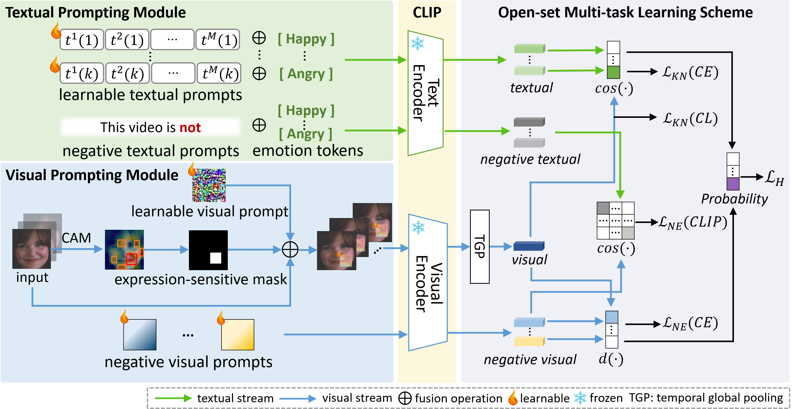

### Open-Set Video-based Facial Expression Recognition with Human Expression-sensitive Prompting

------

#### Accepted by ACM MM2024

The pipeline of  HESP for OV-FER. HESP first combines textual and visual prompting modules to enhance CLIP for modelling facial expression-sensitive information. Then, an open-set multi-task learning scheme is devised to facilitate interactions between these modules, improving OV-FER performance by exploring both known and unknown emotion cues.

------

## Dependencies

- python 3.7.16
- pytorch 1.10.0+cu111

## Train

#### Datasets

In the paper, we introduced 4 Open-Set FER tasks using **AFEW** and **MAFW** datasets, as detailed in Sec. 4.1.2, and an additional task on the large dataset **DFEW**, please refer to Sec. 4.3.4 for details.

The following will provide an example of training this code using the MAFW dataset. MAFW can be obtained from [here](https://mafw-database.github.io/MAFW/).

### Split information

 Split information for all datasets can be found in `split.py`. 

### Running

`python HESP_main.py --dataset 'MAFW'`

## Acknowledgement

 This repository is built based on [ARPL](https://github.com/iCGY96/ARPL) repository. Thanks for the great work. 

